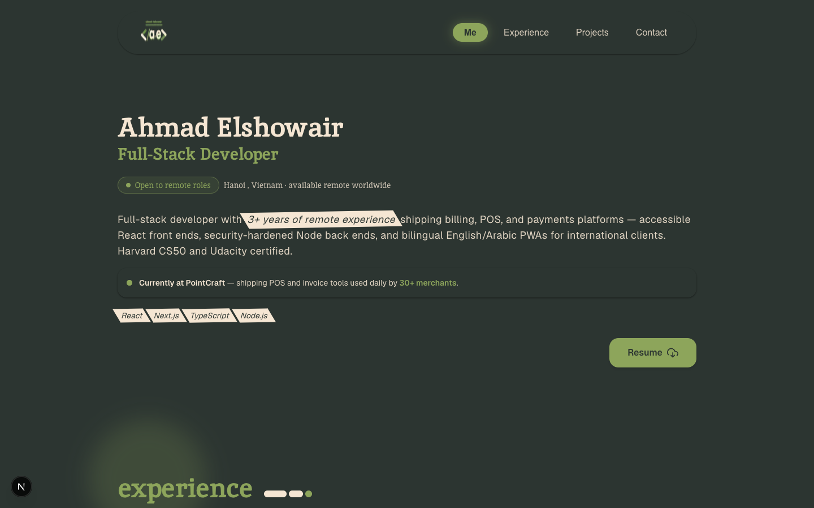

# Ahmad Elshowair — Full-Stack Developer

> Full-stack developer with 3+ years remote experience shipping billing, POS, and payments platforms with React, Next.js, TypeScript, and Node.js.

**[Live Demo](https://ahmad-elshowair.vercel.app)** · **[Architecture](#project-structure)** · **[Getting Started](#getting-started)** · **[Contact](#connect)**

---

## Overview

Personal developer portfolio showcasing production systems, engineering craft, accessible UI design, and verified career milestones. Built with modern web standards, strict static typing, and high-performance server components.

- **Live Production Deployment**: [https://ahmad-elshowair.vercel.app](https://ahmad-elshowair.vercel.app)
- **Primary Domain & Contact**: [ahmad-elshowair.dev@outlook.com](mailto:ahmad-elshowair.dev@outlook.com)

---

## Visual Preview



---

## Tech Stack

| Layer | Technologies |
| :--- | :--- |
| **Framework & Core** | Next.js 16 (App Router), React 19, TypeScript 5 (Strict Mode) |
| **Styling & Motion** | Tailwind CSS 3, `tailwindcss-animate`, Framer Motion, Radix UI Slot |
| **Icons & Media** | Lucide React, React Icons, Self-hosted static assets |
| **Code Quality & CI** | ESLint, TypeScript Compiler (`tsc --noEmit`), GitHub Actions CI |

---

## Key Highlights

- **Accessible & Responsive**: Keyboard navigable, semantic HTML, WCAG 2.1 AA compliant color contrast, and native reduced-motion support.
- **Performant Architecture**: Built on Next.js App Router with server-rendered static generation, zero unapproved third-party tracking scripts, and optimized media assets.
- **Enterprise Design System**: Curated color palette (forest greens, dark slate, muted earth tones) with glassmorphism surface effects and subtle micro-interactions.
- **Automated CI Pipeline**: Full pull-request and push verification enforcing strict typechecking, linting, and production builds.

---

## Project Structure

```text
my-portfolio/
├── .github/
│   └── workflows/
│       └── ci.yml               # Automated CI (lint, typecheck, build)
├── public/
│   ├── files/                   # Canonical resume PDF
│   └── images/                  # Self-hosted project screenshots & preview
├── src/
│   ├── app/                     # App Router pages, layout, SEO metadata
│   ├── components/              # Accessible UI components (Hero, Projects, Contact...)
│   ├── data/                    # Static portfolio data & project definitions
│   ├── definitions/             # TypeScript data contracts & type definitions
│   └── lib/                     # Custom hooks and utility functions
├── package.json                 # Dependencies & scripts
└── tailwind.config.js           # Design tokens & color palette
```

---

## Getting Started

### Prerequisites

- **Node.js**: `22.x` LTS (or `20.x`+)
- **pnpm**: `9.x` or later (`corepack enable pnpm` or `npm install -g pnpm`)

### Installation

Clone the repository and install dependencies using `pnpm`:

```bash
git clone https://github.com/ahmad-elshowair/my-portfolio.git
cd my-portfolio
pnpm install
```

### Development Server

Run the local development server:

```bash
pnpm dev
```

Open [http://localhost:3000](http://localhost:3000) in your browser to view the application.

### Verification & Quality Gates

Run all quality checks locally before submitting code:

```bash
# Linting
pnpm lint

# TypeScript Strict Typecheck
pnpm exec tsc --noEmit

# Production Build
pnpm build
```

---

## Continuous Integration

Every pull request and push to the `main` branch is validated automatically via [GitHub Actions](.github/workflows/ci.yml):

1. **Install**: `pnpm install --frozen-lockfile`
2. **Lint**: `pnpm lint`
3. **Typecheck**: `pnpm exec tsc --noEmit`
4. **Build**: `pnpm build`

---

## Connect

- **Email**: [ahmad-elshowair.dev@outlook.com](mailto:ahmad-elshowair.dev@outlook.com)
- **LinkedIn**: [linkedin.com/in/ahmad-elshowair](https://www.linkedin.com/in/ahmad-elshowair/)
- **GitHub**: [github.com/ahmad-elshowair](https://github.com/ahmad-elshowair)
